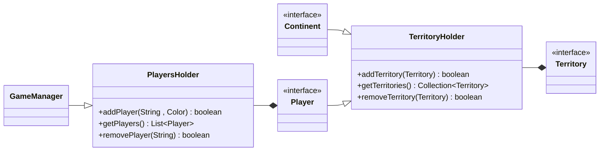

```mermaid
classDiagram
direction LR
    class GameManager {
       
    }

    class PlayersHolder {
        +addPlayer(String , Color) boolean
        +getPlayers() List~Player~
        +removePlayer(String) boolean
    }

    class Territory {
       
    }

    class Continent {
        
    }

    class Player {
        
    }

    class TerritoryHolder {
        +addTerritory(Territory) boolean
        +getTerritories() Collection~Territory~
        +removeTerritory(Territory) boolean
    }

    <<interface>> Territory
    <<interface>> Continent
    <<interface>> Player

    GameManager --|> PlayersHolder
    Continent --|> TerritoryHolder
    PlayersHolder --* Player
    Player --|> TerritoryHolder
    TerritoryHolder --* Territory
```