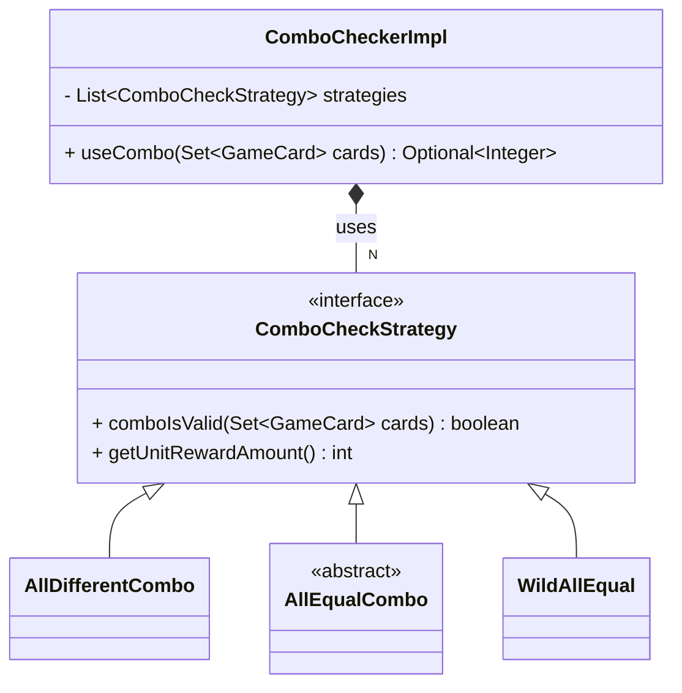
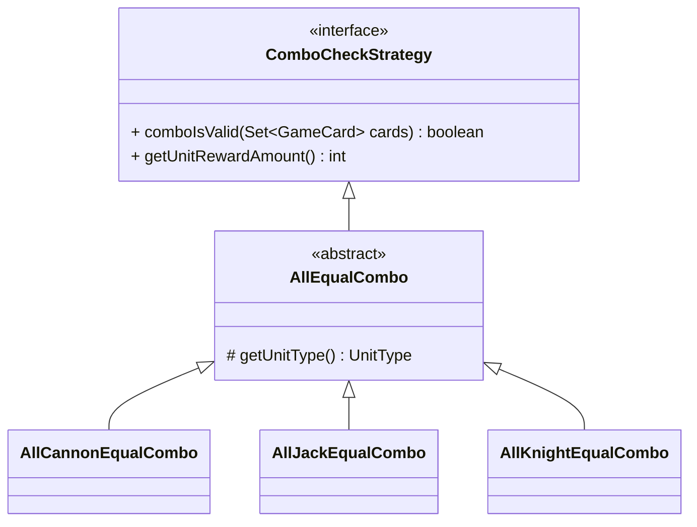

# UML 1

```mermaid
classDiagram
direction TB
	class ComboCheckerImpl {
		- List~ComboCheckStrategy~ strategies
        + useCombo(Set~GameCard~ cards) Optional~Integer~
	}
    class ComboCheckStrategy { <<interface>>
        + comboIsValid(Set~GameCard~ cards) boolean
        + getUnitRewardAmount() int
    }
    class AllDifferentCombo {
    }
    class AllEqualCombo { <<abstract>> 
    }
    class WildAllEqual {
    }

    ComboCheckerImpl *-- "N" ComboCheckStrategy : uses
    ComboCheckStrategy <|-- AllDifferentCombo
    ComboCheckStrategy <|-- AllEqualCombo
    ComboCheckStrategy <|-- WildAllEqual
```

# UML 2

```mermaid
classDiagram
direction TB
    class ComboCheckStrategy { <<interface>>
        + comboIsValid(Set~GameCard~ cards) boolean
        + getUnitRewardAmount() int
    }
    class AllEqualCombo { <<abstract>> 
        # getUnitType() UnitType
    }
    class AllCannonEqualCombo {
    } 
    class AllJackEqualCombo {
    }
    class AllKnightEqualCombo {
    }

    ComboCheckStrategy <|-- AllEqualCombo
    AllEqualCombo <|-- AllCannonEqualCombo
    AllEqualCombo <|-- AllJackEqualCombo
    AllEqualCombo <|-- AllKnightEqualCombo
```