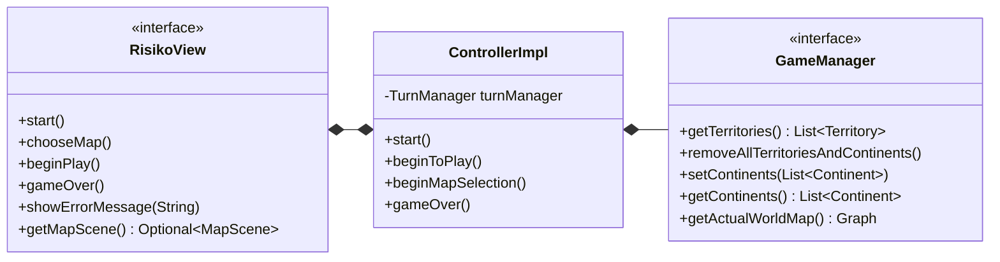

```mermaid
classDiagram
direction RL
    class ControllerImpl {
	    -TurnManager turnManager
	    +start()
	    +beginToPlay()
	    +beginMapSelection()
	    +gameOver()
    }

    class RisikoView {
	    +start()
	    +chooseMap()
	    +beginPlay()
	    +gameOver()
	    +showErrorMessage(String)
	    +getMapScene() Optional~MapScene~
    }

    class GameManager {
	    +getTerritories() List~Territory~
	    +removeAllTerritoriesAndContinents()
	    +setContinents(List~Continent~)
	    +getContinents() List~Continent~
	    +getActualWorldMap() Graph
    }

	<<interface>> RisikoView
	<<interface>> GameManager

    ControllerImpl *--* RisikoView
    GameManager --* ControllerImpl
```