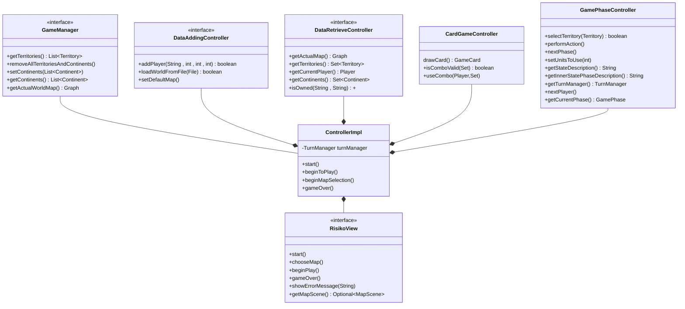

```mermaid
classDiagram
direction TB
    class ControllerImpl {
	    -TurnManager turnManager
	    +start()
	    +beginToPlay()
	    +beginMapSelection()
	    +gameOver()
    }

    class RisikoView {
	    +start()
	    +chooseMap()
	    +beginPlay()
	    +gameOver()
	    +showErrorMessage(String)
	    +getMapScene() Optional~MapScene~
    }

    class GameManager {
	    +getTerritories() List~Territory~
	    +removeAllTerritoriesAndContinents()
	    +setContinents(List~Continent~)
	    +getContinents() List~Continent~
	    +getActualWorldMap() Graph
    }

    class DataAddingController {
	    +addPlayer(String , int , int , int) boolean
	    +loadWorldFromFile(File) boolean
	    +setDefaultMap()
    }

    class DataRetrieveController {
	    +getActualMap() Graph
	    +getTerritories() Set~Territory~
	    +getCurrentPlayer() Player
	    +getContinents() Set~Continent~
	    +isOwned(String , String) +
    }

    class CardGameController {
	    drawCard() GameCard
	    +isComboValid(Set) boolean
	    +useCombo(Player,Set)
    }

    class GamePhaseController {
	    +selectTerritory(Territory) boolean
	    +performAction()
	    +nextPhase()
	    +setUnitsToUse(int)
	    +getStateDescription() String
	    +getInnerStatePhaseDescription() String
	    +getTurnManager() TurnManager
	    +nextPlayer()
	    +getCurrentPhase() GamePhase
    }

	<<interface>> RisikoView
	<<interface>> GameManager
	<<interface>> DataAddingController
	<<interface>> DataRetrieveController
	<<interface>> DataRetrieveController

    ControllerImpl *-- RisikoView
    GameManager -- ControllerImpl
    DataAddingController --* ControllerImpl
    DataRetrieveController --* ControllerImpl
    CardGameController --* ControllerImpl
    GamePhaseController --* ControllerImpl
```