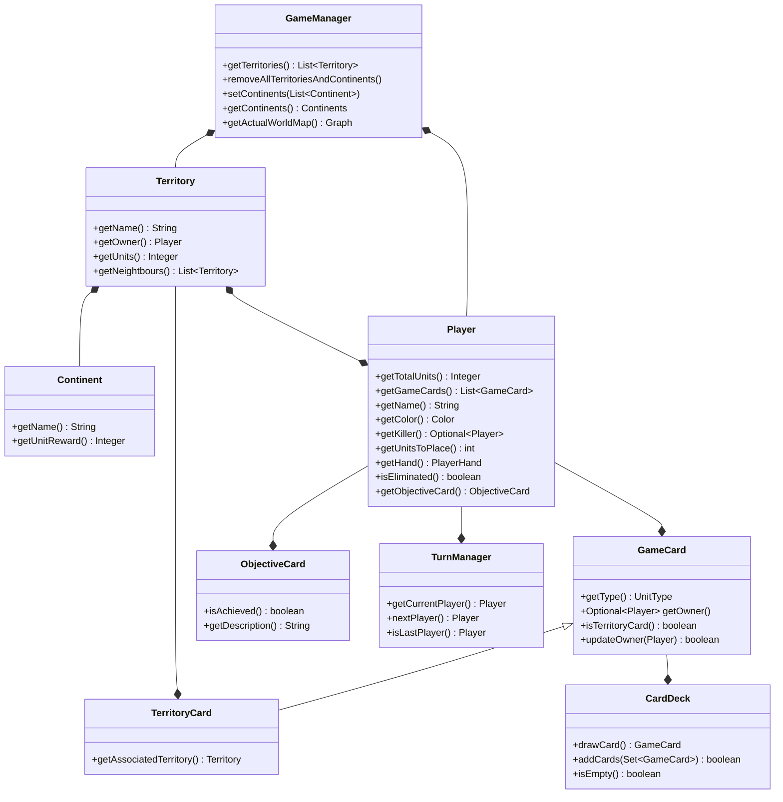

```mermaid
classDiagram
direction BT
    class GameManager {
	    +getTerritories() List~Territory~
	    +removeAllTerritoriesAndContinents()
	    +setContinents(List~Continent~)
	    +getContinents() Continents
	    +getActualWorldMap() Graph
    }

    class Territory {
	    +getName() String
	    +getOwner() Player
	    +getUnits() Integer
	    +getNeightbours() List~Territory~
    }

    class Continent {
	    +getName() String
	    +getUnitReward() Integer
    }

    class Player {
	    +getTotalUnits() Integer 
	    +getGameCards() List~GameCard~ 
	    +getName() String 
	    +getColor() Color 
	    +getKiller() Optional~Player~ 
	    +getUnitsToPlace() int 
	    +getHand() PlayerHand 
	    +isEliminated() boolean 
	    +getObjectiveCard() ObjectiveCard 
    }

    class GameCard {
	    +getType() UnitType
	    +Optional~Player~ getOwner()
	    +isTerritoryCard() boolean
	    +updateOwner(Player) boolean 
    }

    class CardDeck {
	    +drawCard() GameCard 
	    +addCards(Set~GameCard~) boolean 
	    +isEmpty() boolean
    }

    class ObjectiveCard {
	    +isAchieved() boolean
	    +getDescription() String 
    }

    class TerritoryCard {
	    +getAssociatedTerritory() Territory
    }

    class TurnManager {
	    +getCurrentPlayer() Player 
	    +nextPlayer() Player 
	    +isLastPlayer() Player 
    }

    Territory --* GameManager
    Player --* GameManager
    GameCard *-- Player
    ObjectiveCard *-- Player
    TerritoryCard --|> GameCard
    Player *--* Territory
    Continent --* Territory
    CardDeck *-- GameCard
    TurnManager *-- Player
    TerritoryCard *-- Territory
```