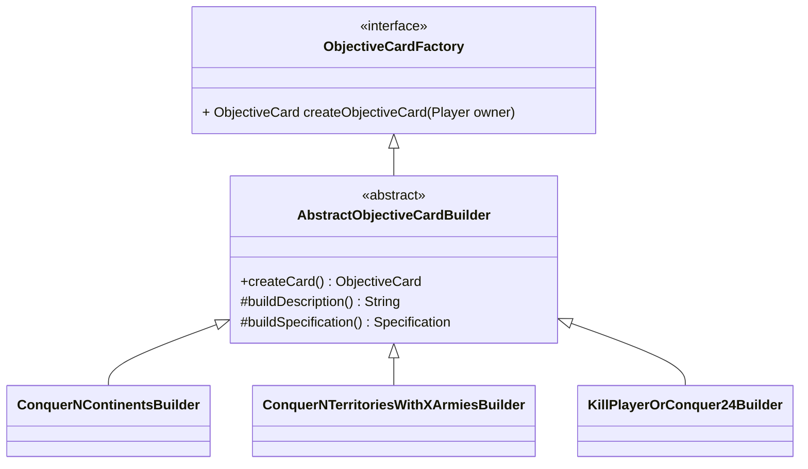
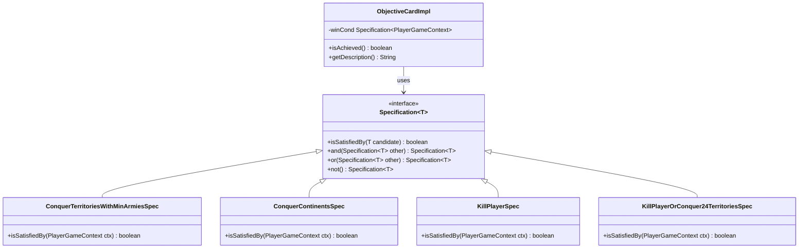

## 2.2.1 Gestione del “mazzo” di carte obiettivo

```mermaid
classDiagram
    class ObjectiveCardFactory{
        <<interface>>
        + ObjectiveCard createObjectiveCard(Player owner)
    }

    class AbstractObjectiveCardBuilder {
        <<abstract>>
        +createCard() ObjectiveCard
        #buildDescription() String
        #buildSpecification() Specification
    }

    class ConquerNContinentsBuilder {

    }

    class ConquerNTerritoriesWithXArmiesBuilder {
    }

    class KillPlayerOrConquer24Builder {
    }

    AbstractObjectiveCardBuilder <|-- ConquerNContinentsBuilder
    AbstractObjectiveCardBuilder <|-- ConquerNTerritoriesWithXArmiesBuilder
    AbstractObjectiveCardBuilder <|-- KillPlayerOrConquer24Builder
    ObjectiveCardFactory <|-- AbstractObjectiveCardBuilder
```
## 2.2.3 Gestione delle fasi di gioco

```mermaid
classDiagram
direction TB
    class GamePhase {
        <<interface>>
	    +boolean selectTerritory(Territory t)
	    +boolean isComplete()
    }
    class PhaseDescribable {
        <<interface>>
	    + String getInnerStatePhaseDescription()
    }
    class PhaseWithActionToPerform {
        <<interface>>
	    + void performAction()
    }
    class PhaseWithAttack {
        <<interface>>
	    + Optional showAttackResults()
	    + void enableFastAttack()
    }
    class PhaseWithInitialization {
        <<interface>>
	    + void initializationPhase()
    }
    class PhaseWithTransaction {
        <<interface>>
	    + void nextState()
	    + InternalState getInternalState()
    }
    class PhaseWithUnits {
        <<interface>>
	    + void setUnitsToUse(int units)
    }
    class AttackPhase {
    }
    class ComboPhaseImpl {
    }
    class InitialReinforcementPhase {
    }
    class MovementPhase {
    }
    class ReinforcementPhase {
    }
    GamePhase <|-- AttackPhase
    GamePhase <|-- ComboPhaseImpl
    GamePhase <|-- InitialReinforcementPhase
    GamePhase <|-- MovementPhase
    GamePhase <|-- ReinforcementPhase
    PhaseDescribable <|-- AttackPhase
    PhaseDescribable <|-- InitialReinforcementPhase
    PhaseDescribable <|-- MovementPhase
    PhaseDescribable <|-- ReinforcementPhase
    PhaseWithActionToPerform <|-- AttackPhase
    PhaseWithActionToPerform <|-- InitialReinforcementPhase
    PhaseWithActionToPerform <|-- MovementPhase
    PhaseWithAttack <|-- AttackPhase
    PhaseWithInitialization <|-- AttackPhase
    PhaseWithInitialization <|-- InitialReinforcementPhase
    PhaseWithInitialization <|-- MovementPhase
    PhaseWithInitialization <|-- ReinforcementPhase
    PhaseWithTransaction <|-- AttackPhase
    PhaseWithTransaction <|-- MovementPhase
    PhaseWithUnits <|-- AttackPhase
    PhaseWithUnits <|-- MovementPhase
```
## 2.2.2 Composizione delle condizioni di vittoria con Specification Pattern

```mermaid
classDiagram
direction TB

class Specification~T~ {
    +isSatisfiedBy(T candidate) boolean
    +and(Specification~T~ other) Specification~T~
    +or(Specification~T~ other) Specification~T~
    +not() Specification~T~
}

class ConquerTerritoriesWithMinArmiesSpec {
    +isSatisfiedBy(PlayerGameContext ctx) boolean
}
class ConquerContinentsSpec {
    +isSatisfiedBy(PlayerGameContext ctx) boolean
}
class KillPlayerSpec {
    +isSatisfiedBy(PlayerGameContext ctx) boolean
}
class KillPlayerOrConquer24TerritoriesSpec {
    +isSatisfiedBy(PlayerGameContext ctx) boolean
}

class ObjectiveCardImpl {
    -winCond Specification~PlayerGameContext~
    +isAchieved() boolean
    +getDescription() String
}

<<interface>> Specification

%% IMPLEMENTAZIONI DI SPECIFICHE
Specification~PlayerGameContext~ <|-- ConquerTerritoriesWithMinArmiesSpec
Specification~PlayerGameContext~ <|-- ConquerContinentsSpec
Specification~PlayerGameContext~ <|-- KillPlayerSpec
Specification~PlayerGameContext~ <|-- KillPlayerOrConquer24TerritoriesSpec

%% RELAZIONI REALE DI USO
ObjectiveCardImpl --> Specification~PlayerGameContext~ : uses
```